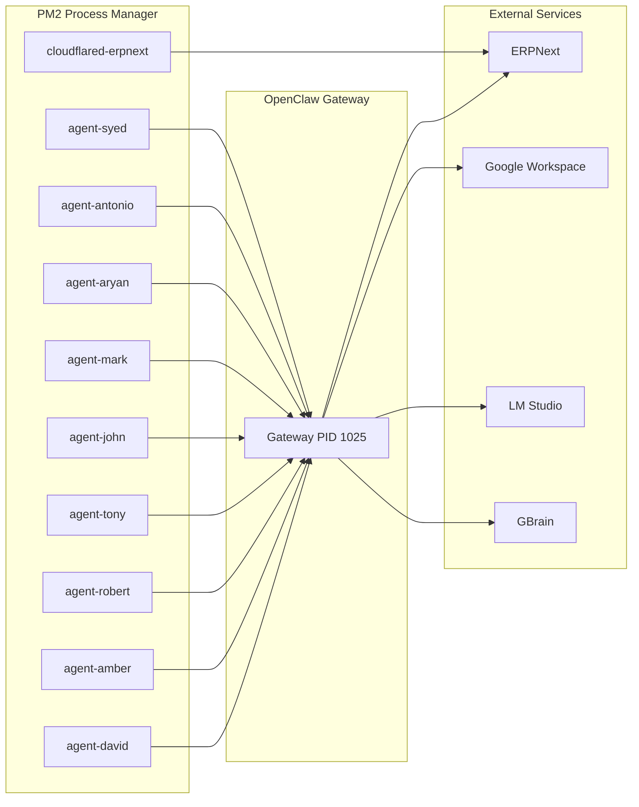

# Agent Fleet

*Live registry of all PM2-managed agents. Update status as changes occur.*
*Last updated: 2026-04-19*

---

## Fleet Overview



---

## Agent Registry

| # | Agent | Human | Role | Status | Email | GWS | ERPNext | Last Activity |
|---|-------|-------|------|--------|-------|-----|---------|---------------|
| 0 | agent-david | David | CEO / Dealmaker | 🟢 Online | david@homegenii.com | ✅ Gmail/Cal/Drive | ✅ | Active |
| 1 | agent-amber | Amber | Business Manager | 🟢 Online | amber@homegenii.com | ✅ Gmail/Cal/Drive | ✅ | Active |
| 2 | agent-robert | Robert | Draftsman / Facility Mgr | 🟢 Online | robert@homegenii.com | ✅ Gmail/Cal/Drive | ✅ | Active |
| 3 | agent-tony | Tony | Labor / Project Coord / QC | 🟢 Online | tony@homegenii.com | ✅ Gmail/Cal/Drive | ✅ | Active |
| 4 | agent-john | John | Land Acq / Broker / Loans | 🟢 Online | john@homegenii.com | ✅ Gmail/Cal/Drive | ✅ | Active |
| 5 | agent-mark | Mark | Realtor / Modular Sales | 🟢 Online | mark@homegenii.com | ✅ Gmail/Cal/Drive | ✅ | Active |
| 6 | agent-aryan | Aryan | Accountant / CFO | 🟡 Online | aryan@geraveshinc.com | ⏳ Pending | ⏳ | Awaiting Telegram |
| 7 | agent-antonio | Antonio | QC / Facility Coord | 🟢 Online | antonio@homegenii.com | ✅ Gmail/Cal/Drive | ✅ | Active |
| 8 | agent-syed | Syed | Software Engineer | 🟡 Online | syedibrahim29192@gmail.com | ⏳ Pending | ⏳ | Awaiting Telegram |
| 9 | cloudflared-erpnext | — | Tunnel / Public Access | 🟢 Online | — | — | — | Active |

---

## Agent Capabilities Matrix

| Capability | David | Amber | Robert | Tony | John | Mark | Aryan | Antonio | Syed |
|------------|:-----:|:-----:|:------:|:----:|:----:|:----:|:-----:|:-------:|:----:|
| ERPNext | ✅ | ✅ | ✅ | ✅ | ✅ | ✅ | ✅ | ✅ | ✅ |
| Google Workspace | ✅ | ✅ | ✅ | ✅ | ✅ | ✅ | ⏳ | ✅ | ⏳ |
| GitHub | ✅ | — | ✅ | — | — | — | — | — | ✅ |
| Claude Code / Codex | ✅ | — | — | — | — | — | — | — | ✅ |
| Pipedream | — | ✅ | — | — | — | — | — | — | — |
| GBrain | ✅ | ✅ | ✅ | ✅ | ✅ | ✅ | ✅ | ✅ | ✅ |

---

## Config Quick Links

| Agent | Config Path | SOUL.md | Logs |
|-------|-------------|---------|------|
| agent-david | `~/.openclaw/agents/david/` | `SOUL.md` | `pm2 logs agent-david` |
| agent-amber | `~/.openclaw/agents/amber/` | `SOUL.md` | `pm2 logs agent-amber` |
| agent-robert | `~/.openclaw/agents/robert/` | `SOUL.md` | `pm2 logs agent-robert` |
| agent-tony | `~/.openclaw/agents/tony/` | `SOUL.md` | `pm2 logs agent-tony` |
| agent-john | `~/.openclaw/agents/john/` | `SOUL.md` | `pm2 logs agent-john` |
| agent-mark | `~/.openclaw/agents/mark/` | `SOUL.md` | `pm2 logs agent-mark` |
| agent-aryan | `~/.openclaw/agents/aryan/` | `SOUL.md` | `pm2 logs agent-aryan` |
| agent-antonio | `~/.openclaw/agents/antonio/` | `SOUL.md` | `pm2 logs agent-antonio` |
| agent-syed | `~/.openclaw/agents/syed/` | `SOUL.md` | `pm2 logs agent-syed` |
| cloudflared | `~/.openclaw/agents/shared/` | — | `pm2 logs cloudflared-erpnext` |

---

## Management Commands

```bash
# Check all agents
pm2 status

# Restart the fleet
pm2 restart all

# Restart a single agent
pm2 restart agent-david

# View logs
pm2 logs agent-david --lines 50

# Monitor resources
pm2 monit
```

---

## Related Pages

- [[00-Command Center/Dashboard]] — Master system view
- [[00-Command Center/Daily Standup]] — Daily fleet health
- [[02-Team-Directory]] — Human roles & responsibilities
- [[01-Projects/Team Rollout Plan]] — Activation timeline
- [[04-Systems-Runbook]] — Infrastructure details

---

*Tag: #agents #fleet #pm2 #status*
