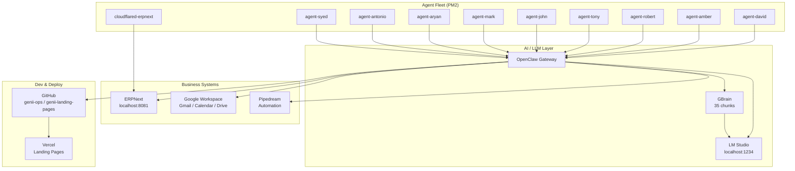

# Genii Studio — Command Center Dashboard

*Master view of all systems, projects, agents, and runbooks.*
*Last updated: 2026-04-19*

---

## System Status Board

| Component | Status | Endpoint / Location | Notes |
|-----------|--------|---------------------|-------|
| Agent Fleet (9) | 🟢 Online | PM2 | All 9 agents + cloudflared healthy |
| ERPNext | 🟢 Fixed | http://localhost:8081 | Login loop resolved, desk stable |
| Google Workspace | 🟢 Active | DWD + Service Account | 7/9 agents reading Gmail/Calendar/Drive |
| LM Studio | 🟢 Running | http://localhost:1234 | gemma-4-e4b, qwen3-coder, nomic-embed |
| OpenClaw Gateway | 🟢 Running | PID 1025 | All agents connected |lot on |
| GitHub | 🟢 Connected | davidmschy | genii-ops + genii-landing-pages |
| Pipedream | 🟡 Setup | CLI v0.5.0 | Workspace auth pending |
| GBrain | 🟢 Operational | ~/obsidian/genii-studio/ | 35/35 chunks embedded, autopi
| Cloudflared | 🟢 Online | tunnel → ERPNext | Public access routing |
| Aryan & Syed Agents | 🟡 Blocked | External emails | Awaiting Telegram usernames |

---

## Quick Navigation

### Command Center
- [[00-Command Center/Daily Standup|Daily Standup Template]]
- [[00-Command Center/Agent Fleet|Agent Fleet Detail]]
- [[Daily-Standup]] — Current standup log

### Projects & Planning
- [[01-Projects/System Integration Plan]] — Master execution plan
- [[01-Projects/Team Rollout Plan]] — Fleet activation timeline
- [[01-Projects/GWS Auth Setup Guide]] — Google Workspace auth fixes
- [[03-Active-Projects]] — Active deals & developments

### Team & Systems
- [[02-Team-Directory]] — Who's who + AI agents
- [[04-Systems-Runbook]] — Build, deploy, infrastructure
- [[05-Decisions-Log]] — Architectural & business decisions

### Daily Notes
- [[99-Daily-Notes/2026-04-18]] — Latest daily note

---

## System Architecture

---

## Active Projects Snapshot

| Project | Status | Owner | Next Action |
|---------|--------|-------|-------------|
| ERPNext Stabilization | 🟢 Complete | Rufio | Monitor, user provisioning |
| GWS Auth (DWD) | 🟢 Complete | David + Rufio | Aryan & Syed onboarding |
| Agent Fleet Deployment | 🟡 In Progress | Rufio | Activate 2 remaining agents |
| Landing Page Pipeline | 🟡 Pending | Syed | Framework decision (Next.js vs Astro) |
| Team Rollout | 🟡 Ready | David | All-hands announcement |
| Obsidian Command Center | 🟢 Complete | Rufio | This page |

---

## Runbook Quick-Refs

| Task | Command / Link |
|------|----------------|
| Check agents | `pm2 status` |
| Restart agents | `pm2 restart all` |
| Agent logs | `pm2 logs agent-david` |
| GBrain status | `gbrain status` |
| GBrain embed | `gbrain embed --stale` |
| ERPNext | http://localhost:8081 |
| LM Studio | http://localhost:1234/v1 |
| Service account key | `~/.config/gcp-service-account.json` |
| Open dashboard | `genii-dashboard` (terminal) |

---

## Decision Queue

See [[05-Decisions-Log]] for full history.

| Date | Decision | Status |
|------|----------|--------|
| Apr 18 | Pipedream over gws direct | ✅ Executed |
| Apr 18 | Obsidian for docs | ✅ Executed |
| Apr 18 | Agent runtime TBD | ⏳ Pending |
| Apr 18 | ERPNext network fix | ✅ Executed |

---

*This dashboard is the single source of truth. Update it when system status changes.*
